# System Architecture Analysis

## Overview

- **Project**: /home/tom/github/wronai/fixop
- **Analysis Mode**: static
- **Total Functions**: 85
- **Total Classes**: 9
- **Modules**: 20
- **Entry Points**: 29

## Architecture by Module

### src.fixop.cli
- **Functions**: 8
- **File**: `__init__.py`

### src.fixop.tls
- **Functions**: 7
- **File**: `tls.py`

### src.fixop.ports
- **Functions**: 6
- **File**: `ports.py`

### src.fixop.dns
- **Functions**: 6
- **File**: `dns.py`

### src.fixop.deploy
- **Functions**: 6
- **File**: `deploy.py`

### src.fixop.cli.fix_cmd
- **Functions**: 6
- **File**: `fix_cmd.py`

### src.fixop.classify
- **Functions**: 5
- **File**: `classify.py`

### src.fixop.systemd
- **Functions**: 5
- **File**: `systemd.py`

### src.fixop.cli.output
- **Functions**: 5
- **File**: `output.py`

### src.fixop.health
- **Functions**: 5
- **Classes**: 2
- **File**: `health.py`

### src.fixop.drift
- **Functions**: 4
- **File**: `drift.py`

### src.fixop.containers
- **Functions**: 4
- **File**: `containers.py`

### src.fixop.firewall
- **Functions**: 4
- **File**: `firewall.py`

### src.fixop.cli.check_cmd
- **Functions**: 3
- **File**: `check_cmd.py`

### src.fixop.models
- **Functions**: 3
- **Classes**: 6
- **File**: `models.py`

### src.fixop.ssh
- **Functions**: 2
- **File**: `ssh.py`

### src.fixop.cli.validate_cmd
- **Functions**: 2
- **File**: `validate_cmd.py`

### src.fixop.transport
- **Functions**: 2
- **Classes**: 1
- **File**: `transport.py`

### src.fixop
- **Functions**: 1
- **File**: `__init__.py`

### src.fixop.cli.drift_cmd
- **Functions**: 1
- **File**: `drift_cmd.py`

## Key Entry Points

Main execution flows into the system:

### src.fixop.cli.main
> Main CLI entry point.
- **Calls**: argparse.ArgumentParser, parser.add_argument, parser.add_subparsers, sub.add_parser, check_p.add_argument, check_p.add_argument, check_p.add_argument, check_p.add_argument

### src.fixop.classify.classify_error
> Classify runtime error by exit code and stderr patterns.

Checks stderr patterns first (more specific), then falls back to exit code map.

Args:
    e
- **Calls**: src.fixop.classify._get_compiled_patterns, Issue, pattern.search, Issue, Issue, detail_parts.append, detail_parts.append, None.join

### src.fixop.tls.check_acme_readiness
> Check if ACME (Let's Encrypt) can issue certificates.

Verifies:
1. DNS resolves from inside the container
2. Port 443 is reachable from outside
3. No
- **Calls**: src.fixop.transport.run_remote, src.fixop.transport.run_remote, src.fixop.transport.run_remote, issues.append, logs.stdout.strip, logs.stdout.lower, check.stdout.lower, dns_check.stdout.lower

### src.fixop.ssh.check_ssh_key
> Check if an SSH key exists locally.

Returns issues if ~/.ssh directory or the specified key is missing.
- **Calls**: Path, Path.home, ssh_dir.exists, issues.append, os.path.expanduser, expanded.exists, list, Issue

### src.fixop.dns.fix_resolv_conf
> Write public DNS nameservers to /etc/resolv.conf on remote host.
- **Calls**: None.join, src.fixop.transport.run_remote, Issue, FixResult, result.stdout.strip, result.stderr.strip, enumerate, None.join

### src.fixop.health.check_tcp_port
> Check if a TCP port is reachable.
- **Calls**: time.time, socket.create_connection, HealthCheckResult, HealthCheckResult, time.time, time.time, str

### src.fixop.health.run_health_checks
> Run comprehensive health checks.

Args:
    ctx: SSH connection context.
    domains: Domains to check HTTPS endpoints for.
    check_ssh: Whether to 
- **Calls**: sum, sum, HealthReport, checks.append, checks.append, src.fixop.health.check_ssh_service, src.fixop.health.check_http_endpoint

### src.fixop.systemd.check_quadlet_loaded
> Check if Quadlet .container files are recognized by systemd.

Quadlet files in /etc/containers/systemd/ are auto-converted to systemd units.
- **Calls**: src.fixop.transport.run_remote, src.fixop.transport.run_remote, issues.append, issues.append, Issue, Issue

### src.fixop.classify.extract_missing_binary
> Extract binary name from 'command not found' stderr.
- **Calls**: stderr.splitlines, line.lower, line.split, len, None.strip

### src.fixop.firewall.fix_ufw_allow_routed
> Set UFW DEFAULT_FORWARD_POLICY to ACCEPT and reload.
- **Calls**: src.fixop.transport.run_remote, Issue, FixResult, result.stdout.strip, result.stderr.strip

### src.fixop.firewall.fix_nat_masquerade
> Add iptables NAT masquerade rule for container subnet.
- **Calls**: src.fixop.transport.run_remote, Issue, FixResult, result.stdout.strip, result.stderr.strip

### src.fixop.dns.fix_disable_systemd_resolved
> Stop and disable systemd-resolved, then set static resolv.conf.
- **Calls**: src.fixop.transport.run_remote, Issue, FixResult, result.stdout.strip, result.stderr.strip

### src.fixop.dns.generate_container_resolv_conf
> Generate resolv.conf file for mounting into containers.

Used when container network doesn't have working DNS.
Mount with: Volume=./resolv.conf:/etc/r
- **Calls**: None.parent.mkdir, None.write_text, None.join, Path, Path

### src.fixop.deploy.check_files_exist
> Verify deploy files exist before upload (pre-SCP gate).

Args:
    file_patterns: Glob patterns relative to base_dir.
    base_dir: Base directory to 
- **Calls**: Path, list, base.glob, issues.append, Issue

### src.fixop.systemd.daemon_reload
> Run systemctl daemon-reload on remote host.
- **Calls**: src.fixop.transport.run_remote, Issue, FixResult, result.stdout.strip, result.stderr.strip

### src.fixop.firewall.check_nat_masquerade
> Check if NAT masquerade exists for container subnet.

Without masquerade, containers on bridge networks cannot reach the internet.
- **Calls**: src.fixop.transport.run_remote, issues.append, result.stdout.strip, Issue

### src.fixop.ports.check_ports
> Check if multiple ports are free.
- **Calls**: issues.extend, src.fixop.ports.check_port

### src.fixop.systemd.graceful_restart_all
> Graceful restart multiple units sequentially.

Each unit is fully stopped and verified before starting the next.
- **Calls**: src.fixop.systemd.graceful_restart, results.append

### src.fixop.classify.get_tip_for_failure
> Return a learning tip relevant to a specific failure.

Extracted from: taskfile/runner/commands.py (_get_tip_for_failure)
- **Calls**: cmd.lower

### src.fixop.cli._has_errors
> Return True if any issue is ERROR or CRITICAL.
- **Calls**: any

### src.fixop.cli._dispatch_check
- **Calls**: src.fixop.cli.check_cmd.cmd_check

### src.fixop.cli._dispatch_fix
- **Calls**: src.fixop.cli.fix_cmd.cmd_fix

### src.fixop.cli._dispatch_validate
- **Calls**: src.fixop.cli.validate_cmd.cmd_validate

### src.fixop.cli._dispatch_check_tls
- **Calls**: src.fixop.cli.validate_cmd.cmd_check_tls

### src.fixop.cli._dispatch_drift
- **Calls**: src.fixop.cli.drift_cmd.cmd_drift

### src.fixop.cli._dispatch_doctor
- **Calls**: src.fixop.cli.check_cmd.cmd_doctor

### src.fixop.models.Issue.__str__
- **Calls**: icon.get

### src.fixop.models.FixResult.__str__

### src.fixop.models.HostContext.__str__

## Process Flows

Key execution flows identified:

### Flow 1: main
```
main [src.fixop.cli]
```

### Flow 2: classify_error
```
classify_error [src.fixop.classify]
  └─> _get_compiled_patterns
```

### Flow 3: check_acme_readiness
```
check_acme_readiness [src.fixop.tls]
  └─ →> run_remote
  └─ →> run_remote
```

### Flow 4: check_ssh_key
```
check_ssh_key [src.fixop.ssh]
```

### Flow 5: fix_resolv_conf
```
fix_resolv_conf [src.fixop.dns]
  └─ →> run_remote
```

### Flow 6: check_tcp_port
```
check_tcp_port [src.fixop.health]
```

### Flow 7: run_health_checks
```
run_health_checks [src.fixop.health]
```

### Flow 8: check_quadlet_loaded
```
check_quadlet_loaded [src.fixop.systemd]
  └─ →> run_remote
  └─ →> run_remote
```

### Flow 9: extract_missing_binary
```
extract_missing_binary [src.fixop.classify]
```

### Flow 10: fix_ufw_allow_routed
```
fix_ufw_allow_routed [src.fixop.firewall]
  └─ →> run_remote
```

## Key Classes

### src.fixop.models.HostContext
> SSH connection context for remote operations.
- **Methods**: 3
- **Key Methods**: src.fixop.models.HostContext.ssh_cmd, src.fixop.models.HostContext.scp_cmd, src.fixop.models.HostContext.__str__

### src.fixop.transport.RemoteResult
> Result of a remote command execution.
- **Methods**: 2
- **Key Methods**: src.fixop.transport.RemoteResult.success, src.fixop.transport.RemoteResult.output

### src.fixop.health.HealthReport
> Aggregated health check report.
- **Methods**: 2
- **Key Methods**: src.fixop.health.HealthReport.healthy_count, src.fixop.health.HealthReport.unhealthy_count

### src.fixop.models.Issue
> A detected infrastructure problem.
- **Methods**: 1
- **Key Methods**: src.fixop.models.Issue.__str__

### src.fixop.models.FixResult
> Result of applying a fix.
- **Methods**: 1
- **Key Methods**: src.fixop.models.FixResult.__str__

### src.fixop.health.HealthCheckResult
> Result of a single health check.
- **Methods**: 0

### src.fixop.models.Severity
- **Methods**: 0
- **Inherits**: Enum

### src.fixop.models.Category
- **Methods**: 0
- **Inherits**: Enum

### src.fixop.models.FixStrategy
- **Methods**: 0
- **Inherits**: Enum

## Data Transformation Functions

Key functions that process and transform data:

### src.fixop.ports.is_container_process
> Check if a process name belongs to a container runtime.
- **Output to**: any, process_name.lower

### src.fixop.tls._validate_expiry
> Check certificate expiry. Returns issues for expired or soon-expiring certs.
- **Output to**: cert.get, None.replace, datetime.strptime, datetime.now, Issue

### src.fixop.tls._validate_issuer
> Check if certificate is self-signed.
- **Output to**: dict, dict, Issue, cert.get, cert.get

### src.fixop.cli.output._format_json
> Serialize issues to JSON string.
- **Output to**: json.dumps

### src.fixop.cli.output._format_text
> Render issues as grouped, human-readable text.
- **Output to**: src.fixop.cli.output._group_by_category, sorted, src.fixop.cli.output._summarize, lines.append, None.join

### src.fixop.cli._dispatch_validate
- **Output to**: src.fixop.cli.validate_cmd.cmd_validate

### src.fixop.cli.validate_cmd.cmd_validate
> Validate deploy artifacts locally.
- **Output to**: src.fixop.deploy.scan_deploy_dir, src.fixop.cli.output.output_issues

## Public API Surface

Functions exposed as public API (no underscore prefix):

- `src.fixop.cli.main` - 46 calls
- `src.fixop.drift.check_file_drift` - 26 calls
- `src.fixop.check_all` - 22 calls
- `src.fixop.drift.check_untracked_files` - 21 calls
- `src.fixop.health.check_http_endpoint` - 20 calls
- `src.fixop.ssh.check_ssh_connectivity` - 19 calls
- `src.fixop.systemd.graceful_restart` - 18 calls
- `src.fixop.classify.classify_error` - 14 calls
- `src.fixop.deploy.scan_deploy_dir` - 14 calls
- `src.fixop.tls.check_acme_readiness` - 14 calls
- `src.fixop.systemd.check_unit_status` - 13 calls
- `src.fixop.containers.check_containers_running` - 12 calls
- `src.fixop.dns.check_container_dns` - 11 calls
- `src.fixop.deploy.check_placeholders` - 11 calls
- `src.fixop.ssh.check_ssh_key` - 11 calls
- `src.fixop.health.check_ssh_service` - 11 calls
- `src.fixop.cli.fix_cmd.cmd_fix` - 10 calls
- `src.fixop.cli.check_cmd.cmd_check` - 9 calls
- `src.fixop.cli.check_cmd.cmd_doctor` - 9 calls
- `src.fixop.containers.check_disk_usage` - 8 calls
- `src.fixop.containers.check_memory` - 8 calls
- `src.fixop.ports.who_uses_port` - 8 calls
- `src.fixop.dns.check_host_dns` - 8 calls
- `src.fixop.dns.fix_resolv_conf` - 8 calls
- `src.fixop.firewall.check_ufw_forward_policy` - 7 calls
- `src.fixop.transport.test_ssh_connection` - 7 calls
- `src.fixop.health.check_tcp_port` - 7 calls
- `src.fixop.health.run_health_checks` - 7 calls
- `src.fixop.ports.check_port` - 6 calls
- `src.fixop.systemd.check_quadlet_loaded` - 6 calls
- `src.fixop.classify.extract_missing_binary` - 5 calls
- `src.fixop.firewall.fix_ufw_allow_routed` - 5 calls
- `src.fixop.firewall.fix_nat_masquerade` - 5 calls
- `src.fixop.ports.find_free_port_near` - 5 calls
- `src.fixop.dns.check_systemd_resolved` - 5 calls
- `src.fixop.dns.fix_disable_systemd_resolved` - 5 calls
- `src.fixop.dns.generate_container_resolv_conf` - 5 calls
- `src.fixop.deploy.check_unresolved_vars` - 5 calls
- `src.fixop.deploy.check_files_exist` - 5 calls
- `src.fixop.tls.check_certificate` - 5 calls

## System Interactions

How components interact:

```mermaid
graph TD
    main --> ArgumentParser
    main --> add_argument
    main --> add_subparsers
    main --> add_parser
    classify_error --> _get_compiled_patter
    classify_error --> Issue
    classify_error --> search
    check_acme_readiness --> run_remote
    check_acme_readiness --> append
    check_acme_readiness --> strip
    check_ssh_key --> Path
    check_ssh_key --> home
    check_ssh_key --> exists
    check_ssh_key --> append
    check_ssh_key --> expanduser
    fix_resolv_conf --> join
    fix_resolv_conf --> run_remote
    fix_resolv_conf --> Issue
    fix_resolv_conf --> FixResult
    fix_resolv_conf --> strip
    check_tcp_port --> time
    check_tcp_port --> create_connection
    check_tcp_port --> HealthCheckResult
    run_health_checks --> sum
    run_health_checks --> HealthReport
    run_health_checks --> append
    check_quadlet_loaded --> run_remote
    check_quadlet_loaded --> append
    check_quadlet_loaded --> Issue
    extract_missing_bina --> splitlines
```



## Reverse Engineering Guidelines

1. **Entry Points**: Start analysis from the entry points listed above
2. **Core Logic**: Focus on classes with many methods
3. **Data Flow**: Follow data transformation functions
4. **Process Flows**: Use the flow diagrams for execution paths
5. **API Surface**: Public API functions reveal the interface

## Context for LLM

Maintain the identified architectural patterns and public API surface when suggesting changes.